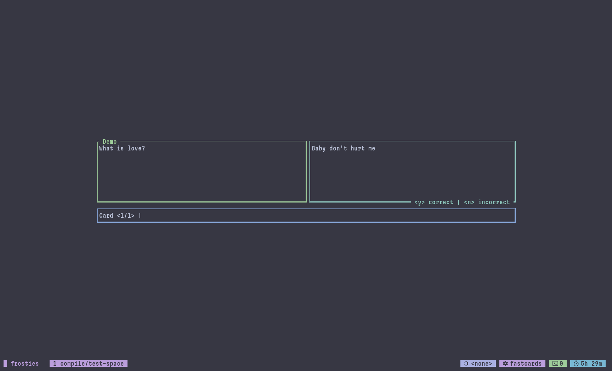

# Fastcards



**Fastcards** is a CLI-based spaced repetition flashcard study tool written in Rust!

## Installation

### from the Binary

Go to the *Releases* section on the right, click the latest release, and click the binary for your architecture to download it.

> [!note]
> On macOS, you will have to compile `fastcards` from source.

### with [wares](https://github.com/indium114/wares)

Simply add the following to your `config.yaml`:

```yaml
wares:
  fastcards:
    name: fastcards
    repo: indium114/fastcards
    asset: "fastcards_Linux_x86_64"
```
> replace `x86_64` with `arm64` if you're on an ARM processor.

### with cargo

Run the following to install *fastcards*. Ensure that `~/.cargo/bin` is in your `$PATH`

```shell
cargo install fastcards
```

## Usage

This section covers basic usage. For more commands, see `fastcards --help`

### Importing flashcards

To add flashcards, this is the step you'll most likely want to take.

You'll need a `.tsv` file with your flashcards in it, conforming to the following format:

```tsv
Deck    Front    Back
```

Each flashcard should be on a separate line.<br/>
You can write your flashcards in any spreadsheet tool, such as LibreOffice Calc, and save it as a `.tsv` file.
> column 1 is the deck name, column 2 is the front of the card, column 3 is the back of the card.

Then, run the following to import the flashcards.

```bash
fastcards import /path/to/flashcards.tsv
```

### Manually adding flashcards

If you don't want to use a `.tsv`, you can use the following commands.

Firstly, create a new deck to store cards.

```shell
fastcards create "Deck Name Here"
```

Then, add a card to it.

```shell
fastcards add "Deck Name Here" "Front of Card" "Back of Card"
```

### Studying

Run the following to study any cards you have due.

```shell
fastcards study [deck]
```

The `deck` argument is optional. You can leave it blank to study all due cards, or provide one to only study due cards from _that_ deck.
